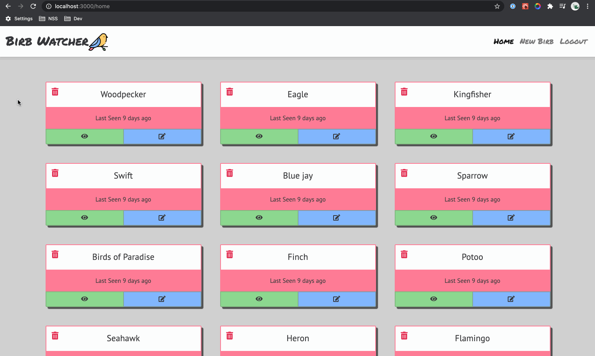

# Bird Watcher

This React web app uses Firebase (with full CRUD utilizing Axios) allowing you to track birds (I named them Birbs on purpose, sorry!). You can add new birbs you saw as well as delete, or edit them. Navigating to single birb pages, editing, and adding new also updates you URL path. This was my first go at React Routing!

## Preview

## Clone the Repository
- Clone it 👉🏼 `$ git clone https://github.com/RyanBeiden/bird-watcher.git`

- Install the dependencies 👉🏼 `$ npm install`

- Run `$ npm start`

## Technologies Used
     
